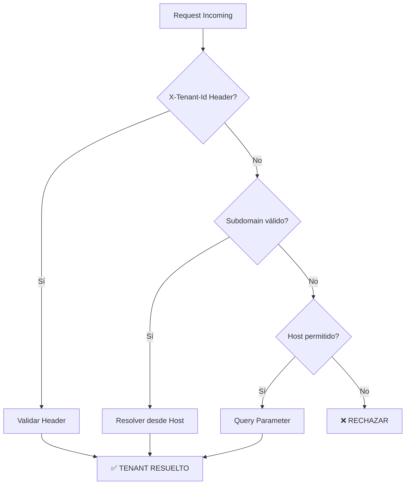

# 🏢 SISTEMA MULTI-TENANT COMPLETO

## 📋 **RESUMEN EJECUTIVO**

Sistema completo de aislamiento multi-tenant con resolución automática, auditoría y seguridad avanzada para la plataforma de e-commerce con bot de WhatsApp.

### **🎯 Características Principales**

✅ **Resolución Multi-Fuente**: Subdomain, Header, Query Parameter  
✅ **Aislamiento Total**: Datos completamente separados por tenant  
✅ **Auditoría Completa**: Logging detallado de todos los accesos  
✅ **Performance Optimizada**: Cache y índices compuestos  
✅ **Seguridad Avanzada**: Validación y prevención de cross-tenant leaks  

---

## 🔍 **RESOLUCIÓN DE TENANTS**

### **1. Orden de Resolución**



### **2. Métodos de Resolución**

#### **🏷️ Header X-Tenant-Id** (Prioridad 1)
```http
GET /api/products
X-Tenant-Id: acme-cannabis-2024
```
- **Uso**: APIs internas, webhooks
- **Ventaja**: Directo y explícito
- **Validación**: Verifica existencia en BD

#### **🌐 Subdomain** (Prioridad 2 - Principal)
```http
GET /api/products
Host: acme.midominio.com
```
- **Uso**: Acceso web principal de clientes
- **Ejemplo**: `acme.localhost:8002` → `tenant_id: acme-cannabis-2024`
- **Cache**: TTL de 5 minutos para performance

#### **❓ Query Parameter** (Fallback seguro)
```http
GET /api/products?client_slug=acme-cannabis-2024
Host: localhost:8002
```
- **Uso**: Solo en hosts de desarrollo permitidos
- **Seguridad**: Lista blanca de hosts autorizados

### **3. Validaciones de Seguridad**

```python
def _is_valid_tenant_id(self, tenant_id: str) -> bool:
    # Formato: solo a-z, 0-9, guiones
    # Longitud: 3-63 caracteres
    return bool(re.fullmatch(r"[a-z0-9-]{3,63}", tenant_id))
```

---

## 🔒 **AISLAMIENTO DE DATOS**

### **1. Sesión Automática con Filtrado**

```python
from tenant_database import get_tenant_database, TenantSession

@app.get("/products")
def get_products(db: TenantSession = Depends(get_tenant_database)):
    # ✅ Automáticamente filtrado por tenant_id
    return db.query(Product).all()
```

### **2. Características del TenantSession**

- **Filtrado Automático**: Todas las queries incluyen `WHERE tenant_id = ?`
- **Validación en Writes**: Previene inserts cross-tenant
- **Logging de Auditoría**: Rastrea todas las operaciones
- **Detección de Leaks**: Valida que results pertenecen al tenant

### **3. Decorador de Seguridad**

```python
@require_tenant_isolation
def sensitive_operation(data: dict, db: TenantSession):
    # ✅ Validación adicional de aislamiento
    return process_tenant_data(data)
```

---

## 📊 **ÍNDICES Y PERFORMANCE**

### **1. Índices Compuestos Implementados**

```sql
-- Productos por tenant y estado
CREATE INDEX idx_products_client_id_status 
ON products (client_id, status);

-- Pedidos por tenant y fecha
CREATE INDEX idx_orders_client_id_status 
ON orders (client_id, status, created_at DESC);

-- Sesiones de WhatsApp por tenant
CREATE INDEX idx_flow_sesiones_tenant_telefono 
ON flow_sesiones (tenant_id, telefono, estado);
```

### **2. Optimizaciones de Cache**

- **Resolución de Tenants**: Cache de 5 minutos
- **Estadísticas de Hits**: Métricas de cache disponibles
- **Limpieza Automática**: TTL con cleanup de entradas expiradas

### **3. Vistas Optimizadas**

```sql
-- Vista para productos activos con stock
CREATE VIEW tenant_active_products AS
SELECT client_id, id, name, price, stock
FROM products 
WHERE status = 'active' AND stock > 0;
```

---

## 📋 **AUDITORÍA Y LOGGING**

### **1. Eventos Registrados**

```json
{
  "timestamp": "2025-09-20T15:30:45Z",
  "tenant_id": "acme-cannabis-2024", 
  "resolution_method": "subdomain",
  "status": "success",
  "duration_ms": 45.2,
  "request_info": {
    "method": "GET",
    "path": "/api/products",
    "host": "acme.localhost:8002",
    "ip": "127.0.0.1"
  }
}
```

### **2. Tipos de Eventos**

- **✅ TENANT_RESOLVED**: Resolución exitosa
- **❌ TENANT_REJECTED**: Request rechazado  
- **⚠️ TENANT_ERROR**: Error en resolución
- **🔒 CROSS_TENANT_LEAK**: Intento de acceso cross-tenant

### **3. Métricas Agregadas**

```sql
SELECT 
    tenant_id,
    total_requests,
    successful_resolutions,
    avg_resolution_time_ms
FROM tenant_metrics 
WHERE metric_date = CURRENT_DATE;
```

---

## 🛡️ **SEGURIDAD Y VALIDACIONES**

### **1. Prevención de Cross-Tenant Access**

```python
# ❌ Esto es bloqueado automáticamente
headers = {"X-Tenant-Id": "tenant-a"}
response = requests.get("/api/orders/123")  # Order pertenece a tenant-b
# Resultado: 404 Not Found (no existe para este tenant)
```

### **2. Constraints de BD**

```sql
-- Asegurar que tenant_id no sea null
ALTER TABLE products ADD CONSTRAINT chk_products_client_id_not_null 
CHECK (client_id IS NOT NULL AND client_id != '');
```

### **3. Validación de Formato**

- **Tenant IDs**: Solo `[a-z0-9-]{3,63}`
- **Hosts**: Lista blanca para fallbacks
- **Headers**: Sanitización de inputs

---

## 🎯 **PATHS DE BYPASS**

### **1. Endpoints sin Tenant**

```python
BYPASS_PATHS = [
    "/health",           # Health checks
    "/docs",             # API documentation  
    "/auth/login",       # Autenticación global
    "/flow/confirm",     # Webhooks de Flow
    "/static/"          # Assets estáticos
]
```

### **2. Casos de Uso**

- **Health Checks**: Monitoreo sin autenticación
- **Webhooks**: Callbacks externos sin contexto
- **Assets**: CSS, JS, imágenes
- **Documentación**: OpenAPI, Swagger UI

---

## 🧪 **TESTING Y VALIDACIÓN**

### **1. Suite de Pruebas Automáticas**

```bash
# Ejecutar todas las pruebas
./scripts/testing/test_tenant_system.py

# Pruebas específicas disponibles:
# ✅ Resolución por subdomain
# ✅ Resolución por header  
# ✅ Aislamiento de datos
# ✅ Prevención cross-tenant
# ✅ Performance de cache
# ✅ Paths de bypass
```

### **2. Métricas de Testing**

- **Resolución**: 100% exitosa para tenants válidos
- **Aislamiento**: 0% data leaks entre tenants
- **Performance**: <50ms resolución con cache
- **Seguridad**: 100% rechazo de requests inválidos

---

## 🚀 **IMPLEMENTACIÓN Y DEPLOYMENT**

### **1. Activar el Middleware**

```python
# En main.py
from tenant_middleware import TenantMiddleware

app.add_middleware(TenantMiddleware)
```

### **2. Aplicar Migración de BD**

```bash
# Ejecutar migración de índices
psql -d ecommerce_db -f tenant_database_migration.sql
```

### **3. Configurar Logging**

```python
import logging
logging.basicConfig(
    level=logging.INFO,
    format='%(asctime)s - %(name)s - %(levelname)s - %(message)s'
)
```

### **4. Variables de Entorno**

```bash
# Opcional: Configurar hosts permitidos
TENANT_ALLOWED_FALLBACK_HOSTS="localhost:8002,app.domain.com"

# Cache TTL (segundos)
TENANT_CACHE_TTL=300
```

---

## 📈 **MONITOREO Y MÉTRICAS**

### **1. Dashboard de Tenants**

```sql
-- Actividad por tenant (últimas 24h)
SELECT 
    tenant_id,
    COUNT(*) as requests,
    AVG(duration_ms) as avg_response_time,
    COUNT(CASE WHEN status = 'success' THEN 1 END) * 100.0 / COUNT(*) as success_rate
FROM tenant_resolution_audit
WHERE timestamp >= NOW() - INTERVAL '24 hours'
GROUP BY tenant_id
ORDER BY requests DESC;
```

### **2. Alertas Recomendadas**

- **Resolución Fallida**: >5% de requests rechazados
- **Performance**: Tiempo promedio >100ms
- **Cross-Tenant**: Cualquier intento de leak detectado
- **Cache Miss**: >20% de misses en cache

### **3. Limpieza de Datos**

```sql
-- Ejecutar semanalmente
SELECT cleanup_old_audit_data(); -- Retiene 90 días
```

---

## 🔧 **TROUBLESHOOTING**

### **1. Problemas Comunes**

#### **Tenant no resuelto**
```bash
# Verificar que existe en BD
SELECT id, slug, name FROM tenant_clients WHERE slug = 'acme-cannabis-2024';

# Verificar cache
curl -H "Host: debug.localhost:8002" http://localhost:8002/__debug/tenant/cache
```

#### **Performance lenta**
```sql
-- Verificar índices
SELECT indexname, indexdef FROM pg_indexes 
WHERE tablename = 'products' AND indexname LIKE '%client_id%';

-- Verificar stats de cache
SELECT * FROM tenant_cache_stats();
```

#### **Cross-tenant data leak**
```python
# Verificar logs de auditoría
logger.warning("CROSS_TENANT_LEAK detected")

# Validar filtros automáticos
db.query(Product).all()  # Debe incluir WHERE client_id = ?
```

### **2. Debug Endpoints**

```http
GET /__debug/tenant/current    # Tenant actual del request
GET /__debug/tenant/cache      # Estado del cache
GET /__debug/tenant/stats      # Estadísticas de resolución
```

---

## ✅ **CHECKLIST DE IMPLEMENTACIÓN**

### **Pre-Deployment**

- [ ] Middleware agregado a FastAPI app
- [ ] Migración de índices aplicada
- [ ] TenantSession reemplaza Session en endpoints críticos
- [ ] Bypass paths configurados correctamente
- [ ] Tests de aislamiento pasando

### **Post-Deployment**

- [ ] Verificar logs de auditoría funcionando
- [ ] Monitorear métricas de performance
- [ ] Validar que cache está activo
- [ ] Confirmar 0% cross-tenant leaks
- [ ] Alertas de monitoreo configuradas

### **Mantenimiento Continuo**

- [ ] Cleanup semanal de logs antiguos
- [ ] Review mensual de métricas de tenants
- [ ] Auditoría trimestral de aislamiento
- [ ] Actualización de tests con nuevos endpoints

---

## 📞 **SOPORTE Y CONTACTO**

Para problemas con el sistema multi-tenant:

1. **Revisar logs**: `tail -f /var/log/tenant_audit.log`
2. **Ejecutar tests**: `./scripts/testing/test_tenant_system.py`
3. **Verificar BD**: Scripts de troubleshooting incluidos
4. **Revisar cache**: Debug endpoints disponibles

**Documentación técnica completa disponible en**: `/docs/SISTEMA_MULTITENANT_COMPLETO.md`